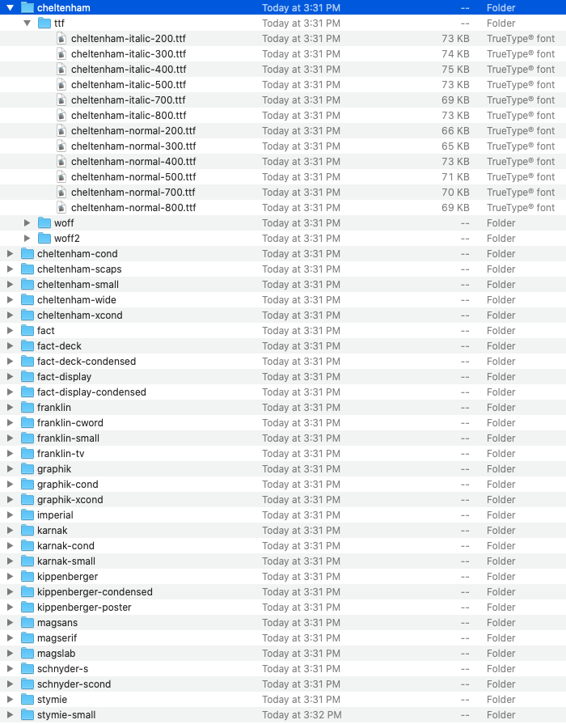

# Fetch New York Times webfonts
### *Download webfonts used on NYTimes.com!*
---

Python tool to fetch web fonts from NYTimes.com. Minimal assembly required.

These fonts are presumeably licensed somewhere. Assume personal, non-commercial use only...



## Requirements

- python >= 3.3

## Usage

```shell
cd <PROJECT_PATH>

python -m venv env
source env/bin/activate
pip install -r requirements.txt

python fetch.py <save_path>
```

- Replace `<PROJECT_PATH>` with the root directory of this repository
- Replace `<save_path>` with where you'd like to save font files, or omit to save to `~/Downloads/nytfonts`
